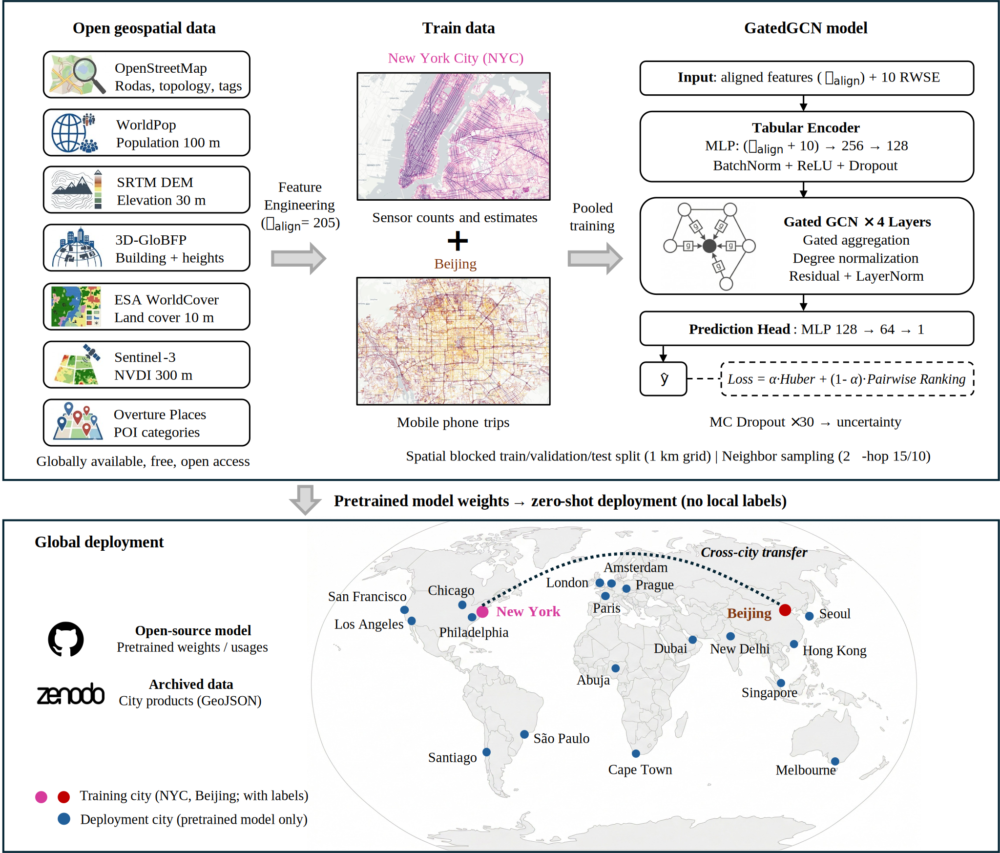

# WalkGeoAI: Estimating street-level pedestrian density using globally available data

**WalkGeoAI** is an end-to-end, open-source Python framework designed to estimate relative street-level pedestrian density for any city worldwide. By leveraging exclusively open geospatial data (e.g., OpenStreetMap, WorldPop, ESA WorldCover, Overture Maps) and a spatially-aware Graph Neural Network (GatedGCN), WalkGeoAI bypasses the need for expensive local pedestrian count data.

This repository contains the complete feature extraction pipeline, the inference script, and the pretrained model weights (trained on ground-truth data from New York City and Beijing), enabling zero-shot spatial transfer inference on structurally distinct cities globally.

<p align="center">
  
</p>

***

## 📂 Repository Structure

The repository is organized into a modular feature extraction pipeline and an inference engine:

### Feature Extraction Scripts

These scripts process raw global open data into 129 standardized, street-segment-level features.

* `1. Network Topology Features.py`: Extracts street network topology, centrality (betweenness/closeness), and morphometric features using OSMnx and NetworKit.
* `2. Population Demand Features.py`: Computes local population densities and gradients using 100m WorldPop rasters.
* `3. Terrain Topography Features.py`: Calculates street slopes and relative elevations using NASADEM.
* `4. Urban Context Features.py`: Determines macroscopic urban structure metrics, including distance to population-weighted centers and subcenters.
* `5. Building Morphology Features.py`: Extracts building footprint metrics (coverage, FAR, height, street-wall ratio) using the 3D-GloBFP dataset.
* `6. Land Cover & Greenness Features.py`: Computes environmental composition and NDVI using ESA WorldCover and Copernicus optical data.
* `7. POI Activity Features.py`: Calculates granular semantic point-of-interest (POI) densities using Overture Maps data.

### Model & Inference

* `WalkGeoAI Inference Pipeline.py`: The main execution script. It loads the extracted features, constructs the spatial graph with Random Walk Positional Encodings (RWSE), and runs the GatedGCN model to predict relative pedestrian density and spatial uncertainty.
* `best_Pooled_Model_active_density.pt`: The pretrained PyTorch model weights and configuration dictionary (trained jointly on NYC and Beijing).
* `Feature dictionary.csv`: A comprehensive data dictionary detailing the definition, scale, and units of all 129 extracted built-environment features.

---

## 🚀 How to Use (Workflow)

### Step 1: Prepare Open Data

Before running the pipeline, download the necessary raw global datasets for your target city (e.g., Philadelphia, Melbourne, Cairo) and place them in your specified data directory.

* **Required Data:** OpenStreetMap (handled automatically via OSMnx), WorldPop `.tif`, NASADEM `.tif`, ESA WorldCover `.tif`, Global Urban Boundaries (GUB) `.shp`, 3D-GloBFP shapefiles, and Copernicus NDVI.

### Step 2: Run the Feature Extraction Pipeline

Run scripts `1` through `7` sequentially. Make sure to update the `base_dir` and `city_name` variables in each script to match your local setup.

```bash
python "1. Network Topology Features.py"
python "2. Population Demand Features.py"
# ... run all 7 scripts

```

*Note: Each script will output a CSV file into the `data file` directory of your target city.*

### Step 3: Zero-Shot Inference

Once all features are extracted, run the inference pipeline. The script will automatically merge the feature CSVs, handle missing columns (padding with zeros), construct the graph topology, and predict the relative pedestrian density for every street segment.

```bash
python "WalkGeoAI Inference Pipeline.py"

```

**Output:** The script will update your base `road_flows.geojson` file with two new columns:

* `pred_density`: The predicted relative pedestrian density (normalized 0 to 1).
* `pred_uncertainty`: The model's spatial uncertainty score, calculated via Monte Carlo Dropout (30 samples).

---

## 📖 Feature Dictionary

For a detailed explanation of the input features required by the model (e.g., `net_betweenness_seg_val`, `bldg_far_buf200_val`, `poi_l1_shopping_buf200_density`), please refer to the included `Feature dictionary.csv`.

---

## 🌍 Global Dataset Availability

The complete extracted feature matrices, raw GIS files, and final street-level pedestrian density predictions for **20 global cities** are openly available for direct download on Zenodo: **[https://zenodo.org/records/18911188](https://zenodo.org/records/18911188)**.
